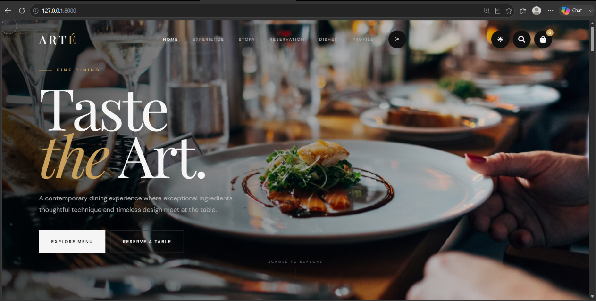
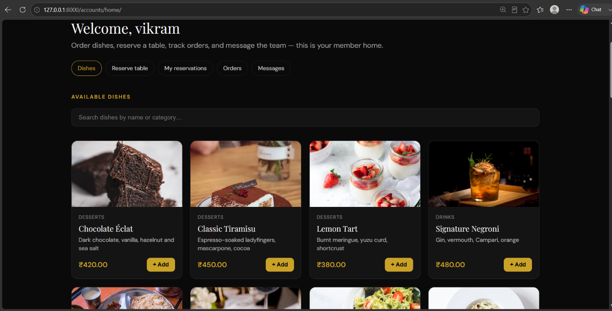
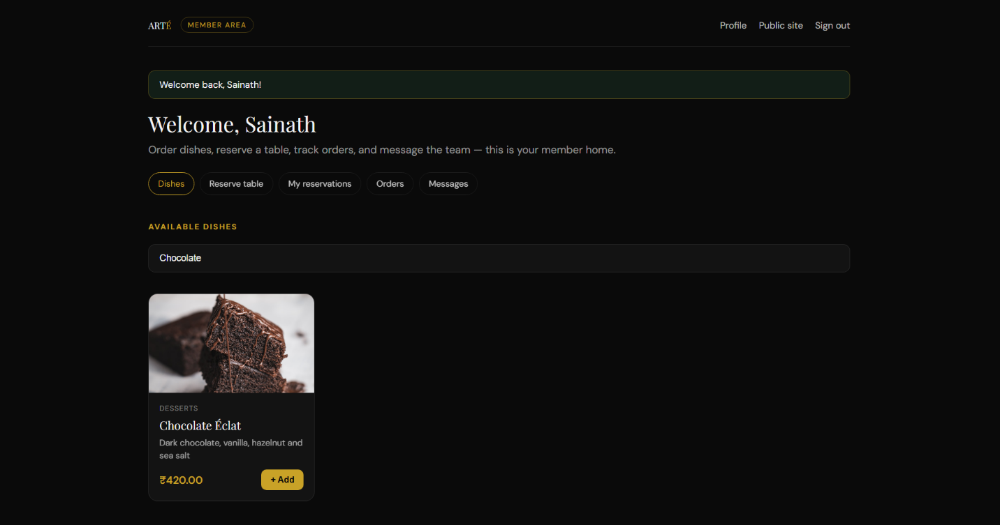
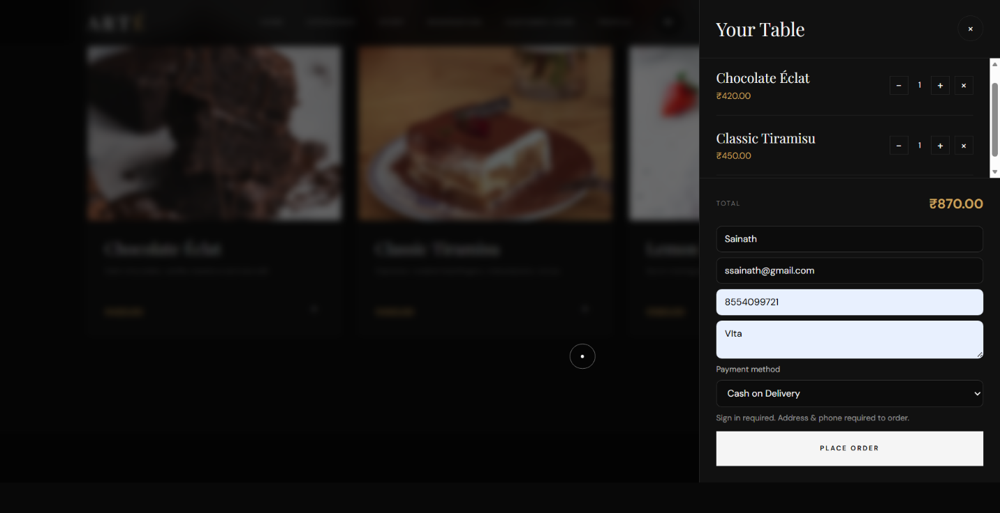
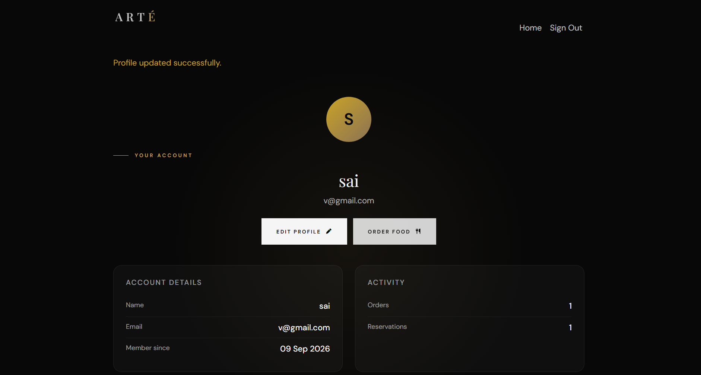
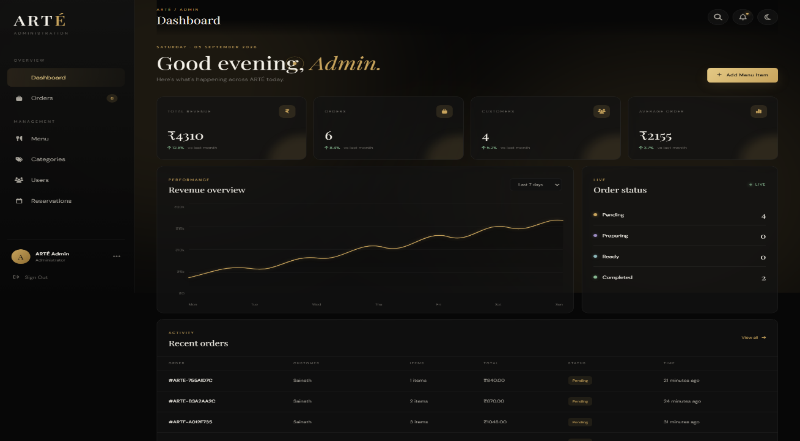

# 🍽️ Food Order System

A full-stack food ordering web application developed using **Python, Django, HTML, CSS, and JavaScript**.

The system allows customers to browse food items, manage their accounts, place orders, make demo payments, and track order status. An integrated admin dashboard provides management of food items, categories, users, orders, reservations, and customer queries.

---

## 🚀 Features

### 👤 User Management
- User registration and login
- Customer profile
- Edit profile
- Password management
- Customer dashboard
- Secure authentication

### 🍔 Food & Menu
- Browse food items
- Food categories
- Food details
- Food images
- Price and description
- Admin menu management
- Add, edit and delete food items

### 🛒 Cart & Ordering
- Add food to cart
- Manage quantities
- Remove items
- Calculate order total
- Checkout
- Order confirmation
- Order history

### 📦 Order Management
- Place orders
- View order details
- Order status tracking
- Cancel orders
- Admin order management

Order status flow:

`Pending → Confirmed → Preparing → Out for Delivery → Delivered`

### 💳 Demo Payment
- Checkout payment selection
- Demo payment processing
- Order confirmation

> This project uses a demonstration payment system for academic purposes and does not process real payments.

### 📅 Reservation
- Table reservation
- Reservation details
- Admin reservation management

### 🛠️ Admin Dashboard
- Dashboard overview
- Manage users
- Manage food items
- Manage categories
- Manage orders
- Manage reservations
- Manage customer queries

---

## 🛠️ Technologies Used

| Technology | Purpose |
|---|---|
| Python | Backend programming |
| Django | Web framework |
| HTML5 | Page structure |
| CSS3 | Styling and responsive design |
| JavaScript | Client-side functionality |
| SQLite | Development database |
| Git | Version control |
| GitHub | Source code hosting |

---

## 📂 Project Structure

```text
Food Order System/
│
├── accounts/
│   ├── migrations/
│   ├── static/
│   ├── templates/
│   ├── forms.py
│   ├── models.py
│   ├── urls.py
│   └── views.py
│
├── arte/
│   ├── settings.py
│   ├── urls.py
│   ├── asgi.py
│   └── wsgi.py
│
├── dashboard/
│   ├── static/
│   ├── templates/
│   ├── models.py
│   ├── urls.py
│   └── views.py
│
├── home/
│   ├── migrations/
│   ├── static/
│   ├── templates/
│   ├── models.py
│   ├── urls.py
│   └── views.py
│
├── media/
│   └── menu/
│
├── templates/
│
├── manage.py
├── requirements.txt
├── seed_data.py
└── README.md
```

---

## 📸 Project Screenshots

### 🏠 Home Page



### 🍔 Food & Menu



### 📋 Food Details



### 🛒 Cart



### 👤 User Profile / Login



### ⚙️ Admin Dashboard


